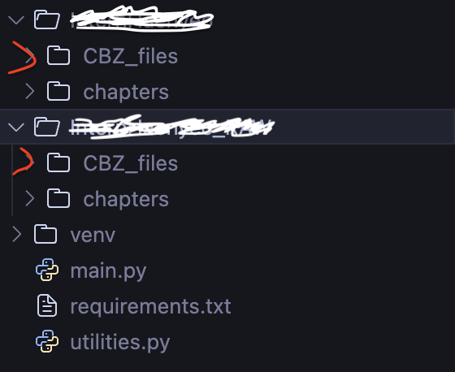

# Manga-forfree-Packer
A CBZ packer for mangaforfree dot net

<div align="center">
    <h1>Mangaforfree.net Packer</h1>
</div>

<div align="center">



</div>

<div align="center">
    <h1>Setup :sweat_drops:</h1>
</div>

## Install requirements

- A fresh installed Arch system: minimal profile, Pipewire, "git" only as additional package, the installation scripts will take care of the rest.

> **Note**
> You need to place the ttf fonts under assets/ some fonts will be installed via yay but others won't. if you do not want to brake the look after reboot you will need at least:  https://github.com/1amSimp1e/fonts/blob/master/CascadiaMono.zip

For additional fonts have a look at: [fonts](https://github.com/iamverysimp1e/fonts)

  ```zsh
  
  paython -m venv venv --prompt="Mangaforfree.net"
  source venv/bin/activate
  pip install -r requirements.txt
  ```

### How to use it

```zsh

python main.py

```

1) you will be prompted for the URL, Example: https://mangaforfree.net/manga/REPLACEMENT/
2) you will be prompted if do/don't you want the RAW (not ENG) version
3) grab a cup of coffee/tea


### Notes

Depending from the amount of chapters, the script might takes a few minutes to finish. with respect in mind of the website and others, 
the script executes calls after a specified amount of time, please be respectful and enjoy your reading also offline.

### Credits

ChatGPT which help me fix issues, optimize the code and figure out things i did not know/remember and most importantly it saved me tons of time


